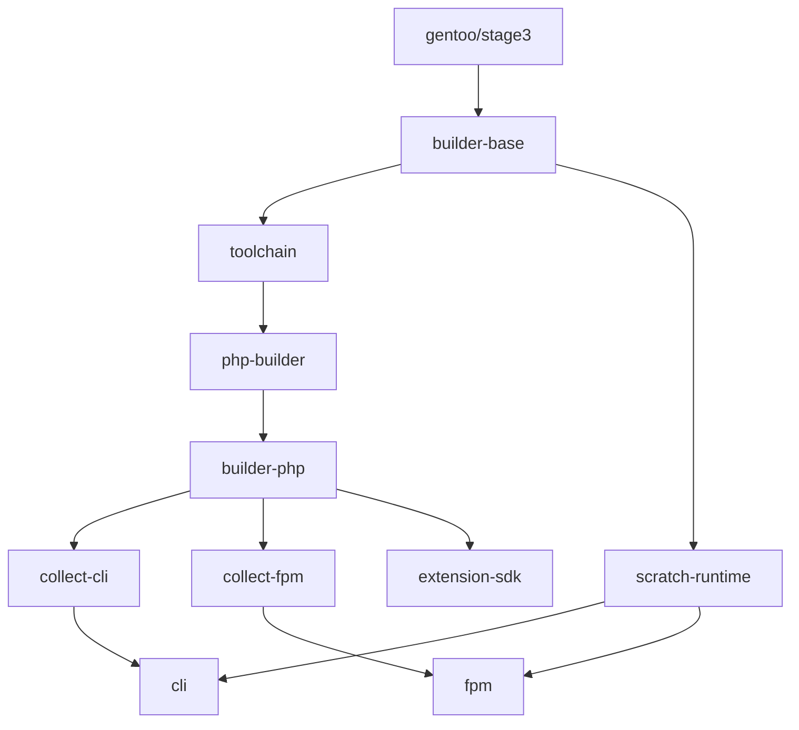

# Architecture — Gentoo PHP Scratch Images

Production-grade PHP 8.5 container images built on Gentoo Hardened, delivered as `FROM scratch` runtimes with docker-library/php API compatibility.

## Design Priorities

1. **Security** — hardened toolchain, non-root, minimal attack surface (no package manager / compiler in runtime)
2. **Size** — only `ldd`-resolved runtime artifacts in final image
3. **Performance** — `-O3`, ThinLTO, `-march` tuning via Gentoo `make.conf`
4. **Compatibility** — `docker-php-ext-*` interface identical to official images
5. **Extensibility** — optional libraries via `install-lib`, Extension SDK image

---

## Pipeline Overview



Each stage has exactly one responsibility. Intermediate stages are cacheable via BuildKit and GitHub Actions `cache-to: type=gha`.

---

## Stage Decisions

### builder-base

**What:** Synchronize Gentoo portage, activate `default/linux/*/23.0/hardened` profile, apply `portage/make.conf`.

**Why hardened profile:**
| Aspect | Impact |
|--------|--------|
| Security | PIE, SSP, CET (where supported) via gcc specs; stack protector by default |
| Performance | ~0–2% vs non-hardened; acceptable tradeoff per priority #1 |
| Size | Neutral |
| docker-library parity | Build-time only; runtime behavior matches official |

**Why not `gentoo/stage3:hardened` tag directly:** Tag availability varies by platform; nomultilib + `eselect profile` is deterministic across amd64/arm64.

### toolchain

**What:** Emerge GCC/binutils + `@php-toolchain` / `@php-build-deps`; install upstream [`docker-php-entrypoint`](https://github.com/docker-library/php/blob/master/8.5/alpine3.24/cli/docker-php-entrypoint) shell script.

**Why official shell entrypoint (not custom C):**
| Aspect | Impact |
|--------|--------|
| Security | Same logic as docker-library; no bespoke PID-1 code to audit |
| Performance | Negligible (<1ms startup via `/bin/sh`) |
| Size | ~1 KB script vs ~50–100 KB static binary |
| docker-library parity | **Identical file** — prepend `php` when first arg starts with `-` |

**Why GCC over Clang for primary toolchain:**
| Aspect | Impact |
|--------|--------|
| Security | Gentoo hardened profile integration is GCC-native; verified RELRO/SSP/FORTIFY |
| Performance | GCC ThinLTO (`-flto=auto`) mature on Gentoo |
| Size | Neutral |
| docker-library parity | Official images use GCC (Debian) |

**Why not BOLT:** Post-link optimization requires per-workload profiling, breaks reproducibility, incompatible with multi-arch generic images. **Rejected.**

### php-builder

**What:** GPG-verified PHP tarball, minimal `-dev` dependencies matching official base image.

**Dependencies included:** libxml2, oniguruma, libsodium, argon2, openssl, zlib, readline, libedit, sqlite, curl.

**Dependencies excluded:** gd, icu, libzip, postgres, gmp — user installs via `install-lib` + `docker-php-ext-install`.

**Why source build (not `emerge dev-lang/php`):**
| Aspect | Impact |
|--------|--------|
| Security | Same supply chain as official: php.net + GPG + optional SHA256 |
| Performance | Full control of configure flags, LTO, `-march` |
| Size | Only install what configure requires |
| docker-library parity | Identical model |

### builder-php

**What:** Single configure + compile producing CLI + FPM + phpdbg superset. Variant split happens only at `collect-*`.

**Configure flags:** Mirror `docker-library/php:8.5-bookworm-{cli,fpm}` (unified superset in one build):

- CLI: `--enable-phpdbg`, `--enable-embed`, `--with-pear`
- FPM: `--disable-phpdbg`, `--enable-fpm`, `--disable-cgi`

**Compiler flags (`docker-php-env`):**
```
-O3 -fstack-protector-strong -fstack-clash-protection -D_FORTIFY_SOURCE=3 -fpic -fpie
LDFLAGS: -Wl,-z,relro -Wl,-z,now -Wl,--as-needed -pie
```

**Why `-O3` over `-O2`:**
| Aspect | Impact |
|--------|--------|
| Security | Neutral with FORTIFY_SOURCE=3 |
| Performance | 5–15% on hot PHP paths |
| Size | Slightly larger text segments; mitigated by strip |
| docker-library parity | Official uses `-O2`; we trade 1 parity point for priority #3 |

**Why `-march=x86-64-v3` (amd64) / `-march=armv8.2-a` (arm64):**
| Aspect | Impact |
|--------|--------|
| Security | Neutral |
| Performance | Significant on AVX2-capable hosts (typical K8s nodes 2018+) |
| Size | Minor code size increase |
| docker-library parity | Official uses generic debian arch; documented deviation |

**Why `-mtune=generic` not `native`:**
| Aspect | Impact |
|--------|--------|
| Security | Neutral |
| Performance | ~3–8% less than native on build host |
| Size | Neutral |
| Reproducibility | **Required** for CI multi-arch determinism |

**Why ThinLTO (`-flto=auto`):**
| Aspect | Impact |
|--------|--------|
| Security | Neutral |
| Performance | 3–10% whole-program optimization |
| Size | Often reduces duplicate code |
| Build time | +30–60% link time — acceptable in CI with cache |

**Why PGO disabled by default:**
| Aspect | Impact |
|--------|--------|
| Security | Neutral |
| Performance | +5–15% if trained properly |
| Reproducibility | Poor — training workload biases results |
| Build time | 2–3× — offer as future `ENABLE_PGO=1` opt-in |

**FPM non-root design:**
Official `php-fpm` starts as root, drops to `www-data`. We run `USER 82:82` from scratch — master never has UID 0.

| Aspect | Impact |
|--------|--------|
| Security | **Stronger** — no root window, K8s `runAsNonRoot: true` by default |
| Performance | Neutral |
| Size | Neutral |
| docker-library parity | Documented intentional deviation; TCP `:9000`, `SIGQUIT`, stderr logs preserved |

**FPM production config:**
- `pm = dynamic` with tuned spare servers
- `opcache.enable=1`, `validate_timestamps=0`, JIT `1255` / 128M buffer
- `realpath_cache_size=4096K`
- `daemonize = no`, logs to `/proc/self/fd/2`
- `HEALTHCHECK`: `php-fpm -t`

### collect-cli / collect-fpm (runtime-builder)

**What:** BFS over `ldd` dependencies, copy `.so` + dynamic linker, strip, prune build artifacts.

**Pruned from runtime:**
- phpize, pecl, pear, php-config, docker-php-*, install-lib
- headers, pkgconfig, static archives, man pages, docs
- CLI: php-fpm binary and config
- FPM: phpdbg

**Why `ldd` not manual package list:**
| Aspect | Impact |
|--------|--------|
| Security | Only proven-needed libraries enter scratch |
| Performance | Neutral |
| Size | Minimal closure — adapts automatically when extensions added |
| docker-library parity | Official Debian images ship full distro; we optimize for scratch |

**analyze-deps.sh:** Reports RELRO, PIE, stack canary, duplicate `.so` basenames — build-time audit only.

### scratch-runtime

**Included:** passwd/group (www-data UID/GID 82), nsswitch.conf, CA certificates, optional tzdata, static busybox (`/bin/sh`), upstream `docker-php-entrypoint`.

**Excluded:** bash, package manager, compiler, locale, man, cache.

**Why static busybox for `/bin/sh`:**
| Aspect | Impact |
|--------|--------|
| Security | Minimal shell — no apt/emerge/gcc; busybox applets only via symlinks |
| Performance | Neutral |
| Size | ~1 MB static binary — acceptable for docker-library parity |
| docker-library parity | Official images expose `/bin/sh`; enables `docker run … sh -c '…'` |

**Why UID/GID 82:**
Matches official `www-data` on Debian-based PHP images — drop-in K8s compatibility.

### cli / fpm

**What:** `FROM scratch` — copy scratch-runtime + collected staging.

**Kubernetes posture:**
```yaml
securityContext:
  runAsNonRoot: true
  runAsUser: 82
  readOnlyRootFilesystem: true
  allowPrivilegeEscalation: false
  capabilities:
    drop: [ALL]
```

**STOPSIGNAL SIGQUIT** on FPM — graceful worker shutdown per php-fpm.8.

---

## Extension SDK

Target: `extension-sdk` (FROM `builder-php` + PECL).

**Workflow:**
```dockerfile
FROM php:8.5.8-sdk
RUN install-lib libjpeg libpng freetype
RUN docker-php-ext-configure gd --with-freetype --with-jpeg
RUN docker-php-ext-install -j$(nproc) gd
```

**Supported extension patterns:**

| Extension | install-lib | Method |
|-----------|-------------|--------|
| gd | libjpeg libpng freetype | docker-php-ext-* |
| intl | icu | docker-php-ext-* |
| redis | — | docker-php-pecl-install redis |
| swoole | libevent | docker-php-pecl-install swoole |
| grpc | libgrpc protobuf | docker-php-pecl-install grpc |
| mongodb | — | docker-php-pecl-install mongodb |
| xdebug | — | docker-php-pecl-install xdebug |
| apcu | — | docker-php-pecl-install apcu |
| rdkafka | librdkafka | docker-php-pecl-install rdkafka |

---

## docker-php-* Script Compatibility

| Script | Status |
|--------|--------|
| `docker-php-source` | Identical interface |
| `docker-php-ext-configure` | Identical interface |
| `docker-php-ext-install` | Identical interface |
| `docker-php-ext-enable` | Identical + zend_extension detection |
| `docker-php-pecl-install` | Identical interface |
| `docker-php-env` | Gentoo-hardened flags |
| `docker-php-entrypoint` | Upstream shell script, identical behavior |
| `install-lib` | Gentoo-specific; maps apt names → emerge atoms |

Official Dockerfiles work with `apt-get` → replace with `install-lib` / `emerge`.

---

## CI/CD

**GitHub Actions** (`.github/workflows/build.yml`):
- Matrix: `{cli,fpm} × {amd64,arm64}`
- BuildKit GHA cache
- SBOM + provenance attestations
- Cosign signing on git tags
- Secrets: `PHP_GPG_KEYS`, optional `PHP_SHA256`

**Local:**
```bash
export PHP_GPG_KEYS="..."
make verify
docker buildx bake -f docker-bake.hcl all
```

---

## Security Hardening Summary

| Control | Implementation |
|---------|----------------|
| RELRO + BIND_NOW | `-Wl,-z,relro -Wl,-z,now` |
| PIE | `-pie -fpie` + hardened profile |
| FORTIFY | `-D_FORTIFY_SOURCE=3` |
| SSP | `-fstack-protector-strong` |
| Stack clash | `-fstack-clash-protection` |
| NX/ASLR | Kernel + PIE (runtime) |
| CET | `USE=cet` where CPU supports |
| Non-root | USER 82:82 always |
| Minimal shell | Static busybox `/bin/sh` only (no bash) |
| Read-only FS | Designed for K8s readOnlyRootFilesystem |
| SBOM | BuildKit attestation |

---

## Known Deviations from docker-library/php

| Item | Official | Gentoo Scratch |
|------|----------|----------------|
| Base OS | Debian slim | scratch |
| Root user | FPM starts root | Always nonroot |
| Shell | `/bin/sh` (dash) | `/bin/sh` (static busybox) |
| Compiler flags | `-O2` | `-O3` + ThinLTO |
| phpdbg | CLI only | CLI builder only, stripped from runtime |
| pear/pecl in runtime | Present | Builder/SDK only |
| opcache in base CLI | Not enabled | Not enabled (FPM: production ini) |

All deviations are documented and justified by the priority order.

---

## File Layout

```
docker/Dockerfile          # Complete multi-stage pipeline
docker-bake.hcl            # Multi-arch orchestration
portage/                   # Gentoo make.conf, USE, package.env
scripts/docker-php-*       # Official-compatible helpers
scripts/build/             # collect-runtime, analyze-deps, install-lib
scripts/entrypoint/        # Upstream docker-php-entrypoint shell script
configs/                   # FPM + opcache production ini
examples/                  # Downstream extension Dockerfiles
.github/workflows/         # CI
Makefile                   # Local build targets
```
